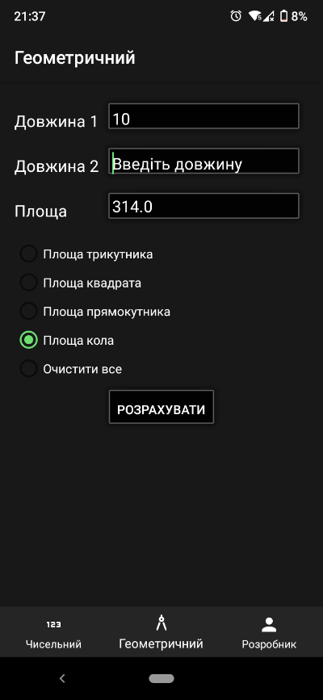

<p align="center"></p>
<h1 align="center">MyCalculator</h1>

## Description
<b>EN:</b>

Ordered course work on the topic "Design and development of the software product «Geometric calculator»".

This is a mobile application that allows you to calculate expressions and geometric quantities.

<b>UA:</b>

Замовлена курсова робота на тему "Проектування та розробка програмного продукту «Геометричний калькулятор»".

Це мобільний додаток, який дозволяє обчислювати вирази та геометричні величини.

#
## Screenshots
<p>
  
  
  
  
  
  
</p>

#
## Technologies used
<b>EN:</b>
- Calculation of simple expressions and geometric quantities
- Convenient navigation through the application

<b>UA:</b>
- Обчислення простих виразів та геометричних величин
- Зручна навігація через додаток

#
## License
```
© 2022, CoolOtaku (ericspz531@gmail.com)
```
